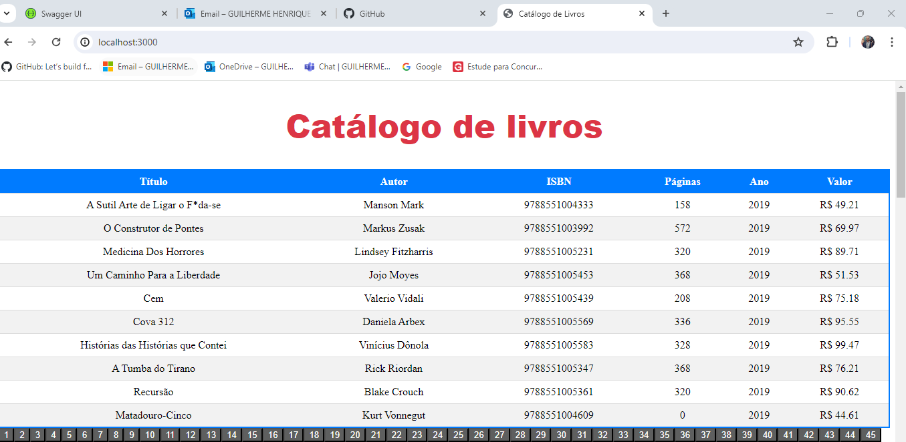

#Catálogo de Livros com Paginação 
Este é um exercicio de um catálogo de livros.

    # Paginacao 
## Descrição
um catálogo de livros que utiliza React para renderização dinâmica dos dados e paginação.

## Funcionalidades
Exibe uma lista de livros com título, autor, ISBN, páginas, ano e preço.
Implementa navegação entre páginas para lidar com grandes conjuntos de dados.
Tecnologias Utilizadas
React: Biblioteca JavaScript para construção de interfaces de usuário.
TypeScript: Adiciona tipagem estática ao JavaScript, trazendo melhorias na manutenção do código.
CSS: Estilos simples aplicados aos elementos HTML.

## Funcionalidades Implementadas

A aplicação carrega inicialmente uma página de livros, limitando a 10 livros por página.
Botões de paginação permitem navegar entre as diferentes páginas de livros.
O número de livros total é exibido dinamicamente conforme a página atual e o total de páginas disponíveis.
Personalização. 
Você pode ajustar o número de itens por página (TAMANHO_PAGINA no código) conforme necessário.
Modifique os estilos no arquivo App.css para atender às necessidades visuais do seu projeto.

## Estrutura
- 

ti_inventario/
├── meu-projeto-react
├── .vscode
├── node_modules/
│   ├── public/
│   │   └── index .html
├── src/
│   ├── componentes/
│   │   ├── app.tsx
│   ├── estilo/
│   │   └── app.css
├── adiciona.livros.js
├── db.js
├── livros.csv
├── package.json
└── package-lock.json


## Instalação

### Pré-requisitos
- Node.js instalado
- MongoDB instalado e rodando na máquina local

### Passos para Instalação
1. Clone o repositório:
    ```sh
    git clone https://github.com/guilhermehlopes/ti_livros.git
    cd ti_livros
    ```

2. Instale as dependências:
    ```sh
    npm install express
    npm install mongodb
    npm install nodemon --save-dev 
    npm install
    npx create-react-app meu-projeto-react
    ```

3. Configure a conexão com o MongoDB (se necessário, altere a URL de conexão no arquivo `src/db.js`).

4. Inicie o servidor:
    ```sh
    npm start
    ```

5. O servidor estará rodando em `http://localhost:3000 `.


## Comentarios
Falta os ajustes do botão:/




